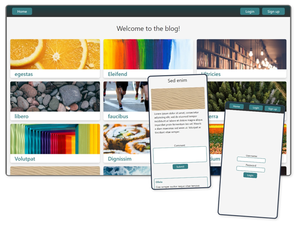

# blog-api-client

The client frontend side of a blog.

    

## Features

- Uses React.
- Communicates with the server via REST API.
- Users are only allowed to read posts and comments, and if they have signed up and are authenticated, add comments as well.
- Posts only display if they have been published by an admin.
- Responsive UI built with Tailwind CSS.

## Client frontend:

- Demo: https://cameronstamant.github.io/blog-api-client/#/
- Repo: https://github.com/CameronStAmant/blog-api-client

## Admin frontend:

- Demo: https://cameronstamant.github.io/blog-api-admin-view/#/
- Repo: https://github.com/CameronStAmant/blog-api-admin-view

## Server:

- Repo: https://github.com/CameronStAmant/blog-api-server

## Normal user:

- Username: user1
- Password: user1

## Admin:

- Username: admin
- Password: admin
